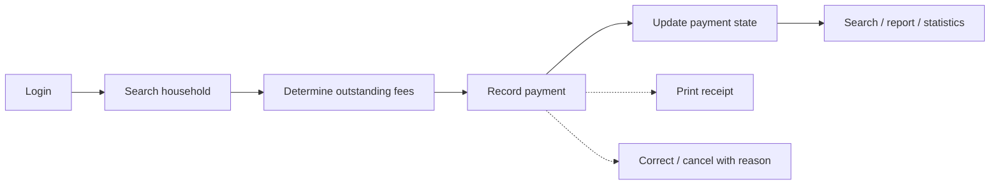

# 04 — As-Is / To-Be Analysis: BlueMoon

| Mục | Giá trị |
|---|---|
| Phiên bản tài liệu | 0.1 (Phase 3 — bản nháp, chờ nhóm xác nhận) |
| Đầu vào | [01_Project_Overview.md](01_Project_Overview.md), [03_Requirement_Elicitation_Plan.md](03_Requirement_Elicitation_Plan.md), [04_Interview_Report.md](04_Interview_Report.md), `deliverables/04_Raw_Requirements.xlsx` (30 RAW) |
| Loại nội dung | As-Is là **quy trình giả định** dựa trên đề bài; Pain Point và To-Be là **Simulated stakeholder input** / *Yêu cầu giả lập từ bối cảnh bài toán* |

> **Lưu ý về nguồn.** Nhóm không quan sát hay phỏng vấn thực tế. Mỗi bước As-Is và mỗi pain point có cột **cơ sở** cho biết nó đến từ đâu: *Đề bài* (đề nêu thẳng), *Suy ra từ đề bài* (hệ quả của cách làm thủ công) hoặc *Giả lập* (chỉ có trong role-play, cần xác thực). Tài liệu này **không sửa** RAW hay các file Phase 0–2.

## 0. Rà soát RAW trước khi phân tích

Nhóm đối chiếu sheet `Raw_Requirements` trong Excel với dữ liệu nguồn của Phase 2: 30 RAW, **0 khác biệt**, không có lỗi nào làm sai nội dung RAW. Có vài ghi chú dưới đây, **chưa sửa RAW**:

| # | Ghi chú | Hướng xử lý |
|---|---|---|
| N-1 | Ba file cùng tiền tố `04_`: `docs/04_Interview_Report.md`, `docs/04_AsIs_ToBe.md`, `deliverables/04_Raw_Requirements.xlsx`. | Giữ tên file theo yêu cầu. Cân nhắc đánh số lại ở phase tổng hợp. |
| N-2 | Phase 2 gợi ý 6 Epic dự kiến, trong khi hướng dẫn BTL nêu 5 Epic. | Quyết định ở phase Epic/Feature (ví dụ gộp hộ gia đình và nhân khẩu). |
| N-3 | Một số con số NFR (3 giây, quy mô, số lần đăng nhập sai) là giả định trong RAW-022, RAW-027, RAW-028. | Mục 6 tinh chỉnh thành tiêu chí kiểm thử và gắn nhãn *proposed / TBD*; RAW giữ nguyên, chỉ cập nhật khi nhóm chủ động quyết định. |
| N-4 | RAW-016 (tìm hộ, kèm số tiền phải nộp) giao một phần với RAW-018 (công nợ), RAW-020 (hộ chưa nộp) giao một phần với RAW-018. Phase 2 đã tách vì khác mục đích (tìm một hộ so với báo cáo toàn bộ hộ). | Giữ nguyên; phân ranh bằng Acceptance Criteria ở phase User Story. |
| N-5 | Bảng Pain Point ở Phase 2 có PP-01…PP-10. Phase 3 phân loại lại PP-10 thành *concern* (mối lo, không phải lỗi quy trình hiện tại), bổ sung PP-11, PP-12 và mở rộng liên kết RAW. | Báo cáo Phase 2 và Interview_Summary trong Excel không sửa (chỉ liệt kê PP-01…10). |

## 1. Phạm vi và quy ước

- Phạm vi: **BlueMoon v1.0** (đăng nhập/đổi mật khẩu, hộ gia đình, nhân khẩu, khoản thu, thu phí, tra cứu/tìm kiếm, thống kê cơ bản). v2.0 (phí gửi xe, điện, nước, internet) chỉ ở mục 5, *Won't-have cho v1.0*.
- ID dùng trong tài liệu: `AI-xx` (bước As-Is), `PP-xx` (pain point), `TB-xx` (bước To-Be), `CAP-xx` (capability v1.0), `ROAD-xx` (roadmap v2.0), `NFR-xxx` (và tiêu chí con `NFR-xxx.n`), `RAW-xxx` (không đổi).

## 2. AS-IS: quy trình hiện tại (giả định)

### 2.1 Mô tả tổng quan

Theo đề bài, Ban quản trị thu phí thủ công, có dùng Excel nhưng hiệu quả chưa cao. Mỗi tháng Ban lập danh sách các khoản phí của từng hộ rồi gửi thông báo thu tiền. Ban cũng phải quản lý thông tin hộ, nhân khẩu (gồm biến đổi nhân khẩu, tạm vắng, tạm trú) và cung cấp cho cơ quan chức năng khi họ yêu cầu. Các công cụ cụ thể như sổ giấy, biên lai hai liên, máy tính cầm tay là **giả định** của nhóm (xem WA-01, WA-02 trong kế hoạch Elicitation).

Có hai quy trình chính:
- **Quy trình A, thu phí** (AI-01…AI-10).
- **Quy trình B, hộ, nhân khẩu và cung cấp thông tin** (AI-11…AI-13).

### 2.2 Bảng quy trình As-Is

| Step | Actor | Current Tool | Input | Activity | Output | Pain Point | Cơ sở |
|---|---|---|---|---|---|---|---|
| AI-01 | Ban quản trị | Excel, ghi chép nội bộ | Quy định phí, đơn giá, diện tích căn hộ | Xác định các khoản thu của tháng hoặc đợt (phí dịch vụ, phí quản lý, đóng góp) và đơn giá áp dụng | Danh sách khoản thu của kỳ | PP-01 | Đề bài (các loại phí); chi tiết công cụ: giả lập |
| AI-02 | Ban quản trị (kế toán) | Excel, máy tính cầm tay | Danh sách hộ, diện tích, đơn giá | Tính tay diện tích × đơn giá cho từng hộ, lập danh sách phí phải đóng | Danh sách khoản phải thu theo hộ | PP-03 | Đề bài (Ban lập danh sách phí hằng tháng); tính tay: suy ra |
| AI-03 | Ban quản trị | Thông báo giấy hoặc tin nhắn | Danh sách khoản phải thu | Gửi thông báo thu tiền cho từng hộ | Thông báo thu tiền | PP-08 | Đề bài (gửi thông báo thu tiền); hình thức gửi: giả lập |
| AI-04 | Hộ gia đình; Thủ quỹ | Excel, sổ giấy | Số căn hộ hoặc tên chủ hộ do hộ cung cấp | Thủ quỹ tìm hộ trong Excel hoặc sổ để biết số tiền cần thu | Hộ được xác định, số tiền phải nộp | PP-04 | Suy ra (quản lý bằng Excel, sổ); quy mô: giả định |
| AI-05 | Thủ quỹ | Sổ giấy, Excel | Tiền nộp, thông tin hộ | Ghi ngày và số tiền vào sổ, sau đó gõ lại vào Excel; trường hợp nộp thiếu hoặc nộp gộp ghi chú bên lề | Dòng ghi sổ và dòng Excel (có thể không khớp) | PP-01, PP-02, PP-12 | Đề bài (thu phí thủ công, có Excel); chi tiết: giả lập |
| AI-06 | Thủ quỹ | Biên lai giấy viết tay | Thông tin giao dịch | Viết biên lai tay và đưa cho hộ | Biên lai giấy | PP-06 | Đề bài (mẫu giấy tờ thu chi thủ công); chi tiết: giả lập |
| AI-07 | Thủ quỹ | Gạch xóa trong sổ; sửa đè trong Excel | Giao dịch nhập nhầm | Sửa giao dịch bằng cách gạch xóa hoặc sửa đè, không ghi lý do | Số liệu đã sửa, không còn dấu vết | PP-05 | Suy ra (sổ giấy và Excel không có log); chi tiết: giả lập |
| AI-08 | Thủ quỹ; Ban quản trị | Excel (lọc), đối chiếu sổ giấy | Excel và sổ thu | Lọc hộ chưa nộp, đối chiếu hai nguồn, nhắc nộp | Danh sách hộ còn thiếu (tạm thời) | PP-02, PP-01 | Suy ra; chi tiết: giả lập |
| AI-09 | Thủ quỹ → Ban quản trị | Excel, máy tính cầm tay | Sổ thu và Excel của kỳ | Đối chiếu, cộng tổng, lập số liệu báo cáo cho Ban | Báo cáo tổng thu của kỳ | PP-11, PP-01 | Đề bài (cần thống kê cơ bản); chi tiết: suy ra |
| AI-10 | Ban quản trị; cơ quan chức năng | Excel, sổ, bản in | Các khoản đóng góp theo đợt | Tổng hợp tổng thu và danh sách hộ đã đóng cho từng đợt, phối hợp với chính quyền và tổ dân phố | Báo cáo đợt đóng góp | PP-11, PP-08 | Đề bài (phối hợp thu); chi tiết: giả lập |
| AI-11 | Chủ hộ; Ban quản trị | Báo miệng hoặc giấy; sổ tay; Excel cũ | Thông tin thay đổi của hộ, nhân khẩu | Chủ hộ báo thay đổi (thêm người, chuyển đi, đổi chủ), Ban ghi lại | Sổ hoặc Excel được cập nhật (không đều) | PP-07, PP-09 | Đề bài (quản lý hộ, nhân khẩu, biến đổi); chi tiết: giả lập |
| AI-12 | Ban quản trị | Sổ, Excel | Thông tin tạm trú, tạm vắng | Ghi nhận tạm trú và tạm vắng, ghi chú thời gian | Thông tin cư trú tạm thời | PP-09 | Đề bài (tạm vắng, tạm trú); chi tiết: giả lập |
| AI-13 | Cơ quan chức năng; Ban quản trị | Excel, bản in, đóng dấu | Yêu cầu cung cấp thông tin | Ban gom danh sách hộ, nhân khẩu từ nhiều nguồn, in hoặc gửi file | Danh sách gửi cơ quan chức năng | PP-07 | Đề bài (cung cấp thông tin khi được yêu cầu); chi tiết: suy ra |

Các công cụ hiện hành (giả định): Excel, sổ giấy, biên lai giấy viết tay, máy tính cầm tay, thông báo giấy hoặc tin nhắn.

## 3. Pain Points

Có **12 mục**: 11 pain point của quy trình hiện tại và 1 concern (mối lo cho hệ thống mới). 10 mục dựa trên đề bài hoặc suy ra từ đề bài. 2 mục (PP-08, PP-12) chủ yếu đến từ role-play nên cần xác thực.

| ID | Loại | Pain point | Cơ sở | Bước As-Is | RAW liên quan | Nguồn |
|---|---|---|---|---|---|---|
| PP-01 | Process pain | Dữ liệu thu phí phân tán ở sổ giấy và Excel, không có một nguồn duy nhất nên hai bên có thể không khớp. | Suy ra từ đề bài (Excel kết hợp thủ công); chi tiết hai nơi ghi: giả lập | AI-01, AI-05, AI-08, AI-09 | RAW-013, RAW-018 | SIM-INT-BQT-Q02, Q03; PS-01 |
| PP-02 | Process pain | Khó theo dõi trạng thái nộp của từng hộ (đã nộp, nộp thiếu, chưa nộp): phải lọc Excel và đối chiếu sổ; nộp thiếu hoặc gộp chỉ ghi chú bên lề. | Suy ra từ đề bài (cần nắm hiện trạng các khoản thu) | AI-05, AI-08 | RAW-013, RAW-018, RAW-020 | SIM-INT-BQT-Q03; SIM-INT-TQ-Q05, Q09; PS-01 |
| PP-03 | Process pain | Tính phí tay (diện tích × đơn giá) cho từng hộ tiềm ẩn nguy cơ sai sót; thông tin hộ sai (ví dụ diện tích) kéo theo sai nhiều kỳ. | Suy ra (phí tính theo m² trong đề); sự cố cụ thể trong role-play là giả lập, không dùng làm số liệu | AI-02 | RAW-004, RAW-011 | SIM-INT-TQ-Q03; SIM-INT-BQT-Q03; SIM-INT-CD-Q11; PS-01 |
| PP-04 | Process pain | Tìm một hộ trong Excel hoặc sổ mất thời gian, nhất là khi có nhiều hộ cần xử lý. | Suy ra (quản lý bằng Excel, sổ); mức chậm phụ thuộc quy mô, giả định | AI-04 | RAW-016, RAW-017, RAW-027 | SIM-INT-TQ-Q03, Q08 |
| PP-05 | Process pain | Truy vết kém: sổ giấy và Excel không ghi ai sửa gì, khi nào, vì sao; sửa đè làm mất dấu vết. | Suy ra (đặc điểm của sổ giấy và Excel); chi tiết: giả lập | AI-07 | RAW-015, RAW-025 | SIM-INT-TQ-Q06; SIM-INT-BQT-Q09 |
| PP-06 | Process pain | Biên lai viết tay tốn thời gian và có thể thiếu thông tin (khoản, kỳ, cách tính). | Suy ra từ đề bài (giấy tờ thu chi thủ công) | AI-06 | RAW-014 | SIM-INT-TQ-Q07; SIM-INT-CD-Q03, Q04; PS-01 |
| PP-07 | Process pain | Thông tin hộ, nhân khẩu rời rạc nên khi cơ quan chức năng yêu cầu, Ban phải gom thủ công từ nhiều nguồn, mất thời gian. | Suy ra từ đề bài (cung cấp thông tin khi được yêu cầu, quản lý thủ công) | AI-11, AI-13 | RAW-003, RAW-006, RAW-009, RAW-017 | SIM-INT-BQT-Q04; SIM-INT-CQ-Q02, Q05; PS-01 |
| PP-08 | Process pain | Cư dân khó hiểu số tiền được tính ra sao và khó biết tổng thu của quỹ đóng góp. | Giả lập từ góc nhìn cư dân (không nằm trong quy trình nội bộ của Ban); cần xác thực | AI-03, AI-10 | RAW-011, RAW-012, RAW-019 | SIM-INT-CD-Q03, Q05 |
| PP-09 | Process pain | Biến động nhân khẩu, tạm trú, tạm vắng không được ghi nhận đều và đủ thời gian; có thể còn thông tin hộ đã chuyển đi. | Suy ra từ đề bài (biến đổi nhân khẩu, tạm vắng, tạm trú); chi tiết: giả lập | AI-11, AI-12 | RAW-005, RAW-007, RAW-008 | SIM-INT-CD-Q06; SIM-INT-CQ-Q03; PS-01 |
| PP-10 | Concern | Lo ngại về bảo mật dữ liệu cá nhân và tài chính: dữ liệu Excel và sổ giấy không có kiểm soát truy cập. Đây là mối lo cho hệ thống mới (driver của NFR), không phải bước lỗi của quy trình hiện tại. | Suy ra (sổ giấy và Excel không có phân quyền); mức lo ngại: giả lập | — | RAW-001, RAW-022, RAW-023, RAW-024 | SIM-INT-CD-Q07; SIM-INT-BQT-Q08 |
| PP-11 | Process pain | Tổng hợp và thống kê (tổng thu, còn thiếu, số hộ, số nhân khẩu) làm thủ công cuối kỳ, khó có số liệu tức thời. | Suy ra từ đề bài (Ban cần thống kê cơ bản để nắm hiện trạng); Phase 3 bổ sung | AI-09, AI-10 | RAW-019, RAW-020, RAW-021 | SIM-INT-BQT-Q07; SIM-INT-CQ-Q11; PS-01 |
| PP-12 | Process pain | Nhập liệu thủ công và trùng lặp: ghi sổ trước rồi gõ lại vào Excel. | Giả lập (role-play thủ quỹ); phù hợp quy trình thủ công trong đề; Phase 3 bổ sung | AI-05 | RAW-013 | SIM-INT-TQ-Q02 |

**Phân nhóm theo chủ đề:**

| Chủ đề | Pain point |
|---|---|
| Mất thời gian tìm kiếm | PP-04, PP-07 |
| Nhập liệu thủ công | PP-12, PP-01 |
| Dễ sai sót | PP-03 |
| Khó tổng hợp, thống kê | PP-11 |
| Khó theo dõi trạng thái | PP-02, PP-09 |
| Truy vết kém | PP-05 |
| Chứng từ, minh bạch | PP-06, PP-08 |
| Bảo mật dữ liệu (concern) | PP-10 |

**Những điều nhóm không ghi là pain point** (đề bài không nói, ghi vào sẽ bị phóng đại):
- Số liệu thiệt hại cụ thể: số tiền thất thoát, số lần sai, thời gian tìm kiếm tính bằng phút. Đề bài không có, role-play chỉ nêu tình huống chung.
- Chuyện cư dân hay phàn nàn hoặc không hài lòng với Ban.
- Số hộ quá lớn gây quá tải. Đề bài không cho số hộ nên mức chậm nào cũng chỉ là giả định.
- Gian lận hoặc cố ý làm sai số liệu.

## 4. TO-BE v1.0

### 4.1 Luồng chính (Visionary, phạm vi v1.0)

```
Login → Search household → Determine outstanding fees → Record payment
      → Update payment state → Search / report / statistics
```



Ngoài luồng chính còn có các việc làm trước hoặc làm song song, không nằm trong vòng thu phí hằng ngày:
- **Thiết lập:** quản lý hộ, nhân khẩu (CAP-03…CAP-07); thiết lập khoản thu và lập danh sách phải thu (CAP-08…CAP-10).
- **Cung cấp thông tin:** Ban xuất hoặc in danh sách cho cơ quan chức năng (CAP-07). Cơ quan chức năng **không** dùng hệ thống (AS-16).

Nhóm đề xuất các trạng thái thanh toán cho phase Feature (**proposed**): *Chưa nộp*, *Nộp một phần*, *Đã nộp đủ*. Giao dịch bị hủy giữ ở trạng thái *Đã hủy*. Hạn nộp (trong RAW-010) có thể dùng để báo cáo "quá hạn".

### 4.2 Các bước To-Be

| Step | Actor | Capability | Input | Output | Giải quyết | RAW |
|---|---|---|---|---|---|---|
| TB-01 Login | Ban quản trị, Thủ quỹ | CAP-01 | Tài khoản, mật khẩu | Phiên làm việc theo quyền | PP-10 | RAW-001, RAW-022, RAW-023 |
| TB-02 Search household | Thủ quỹ | CAP-11 | Số căn hộ hoặc tên chủ hộ | Hộ cần tìm kèm thông tin chính | PP-04 | RAW-016, RAW-027 |
| TB-03 Determine outstanding fees | Thủ quỹ | CAP-12, CAP-09 | Hộ đã chọn, kỳ thu | Danh sách khoản còn thiếu và cách tính | PP-02, PP-03 | RAW-018, RAW-011 |
| TB-04 Record payment | Thủ quỹ | CAP-13 | Khoản, số tiền, ngày, hình thức | Giao dịch thu được lưu | PP-12, PP-01 | RAW-013 |
| TB-05 Update payment state | Hệ thống | CAP-13 | Giao dịch vừa ghi | Trạng thái hộ-khoản cập nhật (nộp một phần, đủ) | PP-02 | RAW-013, RAW-018 |
| TB-05a Print receipt | Thủ quỹ | CAP-14 | Giao dịch | Biên lai in hoặc xuất | PP-06 | RAW-014 |
| TB-05b Correct / cancel | Thủ quỹ, Quản trị | CAP-15 | Giao dịch cần sửa, lý do | Giao dịch điều chỉnh, có log | PP-05 | RAW-015, RAW-025 |
| TB-06 Search / report / statistics | Ban quản trị | CAP-16…CAP-19 | Điều kiện lọc, kỳ, thời điểm | Danh sách, tổng hợp, thống kê | PP-11, PP-02 | RAW-017, RAW-019, RAW-020, RAW-021 |
| TB-07 Provide data to authorities | Ban quản trị | CAP-07 | Yêu cầu của cơ quan | Danh sách xuất hoặc in | PP-07 | RAW-009 |

### 4.3 Capability v1.0 (19 capability chức năng)

| ID | Capability | Mô tả | RAW | Giải quyết pain point | Nhóm |
|---|---|---|---|---|---|
| CAP-01 | Đăng nhập bằng tài khoản được cấp | Chỉ người đăng nhập thành công mới dùng các chức năng quản lý | RAW-001, RAW-022 | PP-10 | Tài khoản |
| CAP-02 | Đổi mật khẩu và thông tin cá nhân của tài khoản | Người dùng tự đổi mật khẩu, cập nhật thông tin cá nhân | RAW-002 | — | Tài khoản |
| CAP-03 | Quản lý hộ gia đình | Thêm, xem, sửa hộ gồm chủ hộ, diện tích, liên hệ | RAW-003, RAW-004 | PP-03, PP-07 | Hộ, nhân khẩu |
| CAP-04 | Đổi chủ hộ / hộ chuyển đi có lịch sử | Ghi nhận thay đổi, không xóa dữ liệu cũ | RAW-005 | PP-09 | Hộ, nhân khẩu |
| CAP-05 | Quản lý nhân khẩu trong hộ | Thêm, sửa nhân khẩu, quan hệ với chủ hộ | RAW-006 | PP-07 | Hộ, nhân khẩu |
| CAP-06 | Biến động nhân khẩu, tạm trú, tạm vắng | Ghi nhận kèm ngày, lý do; xem lịch sử; đánh dấu hết hạn | RAW-007, RAW-008 | PP-09 | Hộ, nhân khẩu |
| CAP-07 | Xuất/in danh sách cho cơ quan chức năng | Ban xuất hoặc in danh sách hộ, nhân khẩu, biến động | RAW-009 | PP-07 | Hộ, nhân khẩu |
| CAP-08 | Thiết lập khoản thu và đơn giá | Tạo, sửa, ngừng khoản thu; đơn giá cấu hình được | RAW-010 | — | Khoản thu |
| CAP-09 | Lập danh sách phải thu và tự tính phí | Tính phí dịch vụ, phí quản lý theo diện tích × đơn giá, hiển thị cách tính | RAW-011 | PP-03, PP-08 | Khoản thu |
| CAP-10 | Khoản đóng góp tự nguyện theo đợt | Ghi nhận số tiền tự nguyện, không coi là nợ | RAW-012 | PP-08 | Khoản thu |
| CAP-11 | Tìm hộ gia đình | Tìm theo số căn hộ, tên chủ hộ | RAW-016 | PP-04 | Tra cứu |
| CAP-12 | Xác định khoản còn thiếu và trạng thái nộp của hộ | Xem công nợ, lịch sử nộp, lọc theo kỳ, khoản, trạng thái | RAW-018 | PP-02 | Tra cứu |
| CAP-13 | Ghi nhận thu phí và cập nhật trạng thái nộp | Hộ, khoản, số tiền, ngày, hình thức; hỗ trợ nộp một phần, nộp gộp; trạng thái hộ-khoản tự cập nhật | RAW-013 | PP-01, PP-02, PP-12 | Thu phí |
| CAP-14 | In/xuất biên lai | Phiếu thu đủ khoản, kỳ, số tiền, ngày, cách tính | RAW-014 | PP-06 | Thu phí |
| CAP-15 | Sửa/hủy giao dịch có lý do | Không xóa cứng, lưu vết người, thời điểm | RAW-015 | PP-05 | Thu phí |
| CAP-16 | Tìm nhân khẩu | Tìm theo họ tên và thông tin cơ bản trên toàn bộ hộ | RAW-017 | PP-04, PP-07 | Tra cứu |
| CAP-17 | Danh sách hộ chưa nộp theo kỳ | Hộ còn nợ khoản bắt buộc để Ban nhắc nộp | RAW-020 | PP-02, PP-11 | Thống kê |
| CAP-18 | Thống kê thu | Tổng đã thu, còn phải thu theo khoản, kỳ, đợt; hộ đã đóng theo đợt | RAW-019 | PP-08, PP-11 | Thống kê |
| CAP-19 | Thống kê hộ, nhân khẩu theo thời điểm | Số hộ, nhân khẩu, tạm trú, tạm vắng tại ngày chọn | RAW-021 | PP-11 | Thống kê |

Capability phi chức năng (xuyên suốt, liên kết NFR ở mục 6): NFR-001 Bảo mật xác thực (RAW-022); NFR-002 Phân quyền (RAW-023); NFR-003 Bảo vệ dữ liệu cá nhân (RAW-024); NFR-004 Audit log (RAW-025); NFR-005 Sao lưu, khôi phục (RAW-026); NFR-006 Hiệu năng (RAW-027); NFR-007 Khả năng sử dụng (RAW-028).

### 4.4 Từ pain point đến capability

| Pain point | Capability To-Be | RAW |
|---|---|---|
| PP-01 | CAP-13 | RAW-013, RAW-018 |
| PP-02 | CAP-12, CAP-13, CAP-17 | RAW-013, RAW-018, RAW-020 |
| PP-03 | CAP-03, CAP-09 | RAW-004, RAW-011 |
| PP-04 | CAP-11, CAP-16 | RAW-016, RAW-017, RAW-027 |
| PP-05 | CAP-15 | RAW-015, RAW-025 |
| PP-06 | CAP-14 | RAW-014 |
| PP-07 | CAP-03, CAP-05, CAP-07, CAP-16 | RAW-003, RAW-006, RAW-009, RAW-017 |
| PP-08 | CAP-09, CAP-10, CAP-18 | RAW-011, RAW-012, RAW-019 |
| PP-09 | CAP-04, CAP-06 | RAW-005, RAW-007, RAW-008 |
| PP-10 | CAP-01 | RAW-001, RAW-022, RAW-023, RAW-024 |
| PP-11 | CAP-17, CAP-18, CAP-19 | RAW-019, RAW-020, RAW-021 |
| PP-12 | CAP-13 | RAW-013 |

## 5. Roadmap v2.0 và ý tưởng ngoài phạm vi

### 5.1 Roadmap v2.0 (Won't-have cho v1.0)

| ID | Hạng mục | Mô tả theo đề bài | RAW | Wish |
|---|---|---|---|---|
| ROAD-01 | Quản lý phí gửi xe | Thu theo tháng theo phương tiện đăng ký của hộ. Xe máy 70.000 đồng/xe/tháng; mức ô tô trong đề ghi "1.200.000 nghìn đồng", cần xác nhận. | RAW-029 | WISH-09 |
| ROAD-02 | Quản lý thu hộ điện, nước, internet | Thu hộ hằng tháng theo thông báo của nhà cung cấp dịch vụ. | RAW-030 | WISH-10 |

ROAD-01 và ROAD-02 không có màn hình, bảng dữ liệu, User Story hay task sprint nào trong v1.0. Khi làm v2.0, hai hạng mục này sẽ đi theo luồng *Search household → Determine outstanding fees → Record payment*, giống các khoản thu hiện có.

### 5.2 Mong muốn ngoài phạm vi v1.0 (không thuộc roadmap v2.0 của đề)

| Mong muốn | Wish | Lý do loại khỏi v1.0 |
|---|---|---|
| Cư dân tự xem phí và lịch sử trên điện thoại | WISH-24 | Đề bài mô tả ứng dụng desktop cho Ban quản trị (AS-02, C-04) |
| Nhắc nộp phí tự động | WISH-25 | Thông báo, nhắc ngoài hệ thống (AS-07, C-05); Ban dùng CAP-17 để nhắc thủ công |

## 6. NFR REFINEMENT

Phase 2 có **7 NFR** (RAW-022…RAW-028). Ở đây nhóm tách chúng thành **21 tiêu chí kiểm thử** (`NFR-xxx.n`), mỗi tiêu chí có chỉ tiêu và cách kiểm tra. Nội dung RAW không đổi.

Cột "Mức chắc chắn" có 3 giá trị: **Fixed** (từ đề bài hoặc quy định của nhóm), **Proposed** (chỉ tiêu nhóm đề xuất, chờ xác nhận) và **TBD** (chưa có số). Phân bố: Fixed 2, Proposed 12, Proposed/TBD 4, TBD 3.

Tải demo lớp học đề xuất cho NFR-006: 500 hộ, 2.000 nhân khẩu, 3 người dùng đồng thời, toàn bộ là dữ liệu giả (AS-13 giới hạn trên, AS-10). Đây là *proposed target*, còn TBD.

### NFR-001 — Bảo mật xác thực (RAW-022)

Phát biểu gốc (Phase 2): *Mật khẩu không lưu ở dạng rõ (băm), giới hạn số lần đăng nhập sai liên tiếp.*

| Tiêu chí | Phát biểu có thể kiểm thử | Chỉ tiêu | Cách kiểm tra | Mức chắc chắn |
|---|---|---|---|---|
| NFR-001.1 | Mọi chức năng quản lý chỉ truy cập được sau khi đăng nhập thành công. | 0 chức năng truy cập được khi chưa đăng nhập | Walkthrough toàn bộ màn hình và chức năng ở trạng thái chưa đăng nhập | Fixed (đề bài) |
| NFR-001.2 | Mật khẩu lưu trong cơ sở dữ liệu ở dạng băm có salt, không lưu dạng rõ. | 100% bản ghi mật khẩu không đọc được thành văn bản gốc | Kiểm tra bảng tài khoản trong cơ sở dữ liệu thử nghiệm | Proposed (phương pháp băm có salt) |
| NFR-001.3 | Sau N lần đăng nhập sai liên tiếp, tài khoản bị khóa tạm thời và từ chối đăng nhập đúng trong thời gian khóa. | N = 5 (proposed target); thời gian khóa = TBD | Nhập sai N lần rồi thử đăng nhập đúng: hệ thống phải từ chối và thông báo lý do | Proposed / TBD |

### NFR-002 — Phân quyền (RAW-023)

Phát biểu gốc (Phase 2): *Phân quyền theo vai trò; tối thiểu phân biệt quản trị và người thu phí.*

| Tiêu chí | Phát biểu có thể kiểm thử | Chỉ tiêu | Cách kiểm tra | Mức chắc chắn |
|---|---|---|---|---|
| NFR-002.1 | Hệ thống có ít nhất hai vai trò (tạm đặt tên: Quản trị, Thu phí) và một ma trận quyền vai × chức năng được tài liệu hóa. | Ma trận quyền được duyệt bởi Product Owner trước khi kiểm thử | Review tài liệu ma trận quyền | TBD (chờ OQ-04, C-01) |
| NFR-002.2 | Mọi chức năng không có quyền với một vai đều bị từ chối khi vai đó truy cập (ví dụ vai Thu phí không sửa được hộ, nhân khẩu, khoản thu, đơn giá, tài khoản). | 100% ô "không có quyền" trong ma trận trả về từ chối truy cập | Kiểm thử theo từng ô trong ma trận quyền | Proposed (nội dung ma trận chờ OQ-04) |

### NFR-003 — Bảo vệ dữ liệu cá nhân (RAW-024)

Phát biểu gốc (Phase 2): *Che bớt số giấy tờ khi hiển thị thường ngày; chỉ người có quyền xem đầy đủ và xuất.*

| Tiêu chí | Phát biểu có thể kiểm thử | Chỉ tiêu | Cách kiểm tra | Mức chắc chắn |
|---|---|---|---|---|
| NFR-003.1 | Số giấy tờ tùy thân (nếu hệ thống lưu) mặc định hiển thị che bớt trên màn hình danh sách và tìm kiếm. | Chỉ hiện 4 ký tự cuối (proposed target) | Kiểm tra trực quan các màn hình danh sách và tìm kiếm | Proposed (phụ thuộc OQ-08) |
| NFR-003.2 | Chỉ vai có quyền mới xem được số giấy tờ đầy đủ và xuất dữ liệu cá nhân. | 100% lần xem đầy đủ hoặc xuất bởi vai không có quyền bị từ chối | Kiểm thử theo ma trận quyền của NFR-002 | Proposed |
| NFR-003.3 | Dữ liệu dùng để demo, kiểm thử và đưa lên GitHub là dữ liệu giả. | 0 bản ghi dữ liệu thật của cư dân | Review bộ dữ liệu mẫu trước mỗi lần demo hoặc commit | Fixed (quy định nhóm, AS-10) |

### NFR-004 — Audit log (RAW-025)

Phát biểu gốc (Phase 2): *Ghi người, thời điểm, thao tác, giá trị trước/sau; log không sửa được qua giao diện.*

| Tiêu chí | Phát biểu có thể kiểm thử | Chỉ tiêu | Cách kiểm tra | Mức chắc chắn |
|---|---|---|---|---|
| NFR-004.1 | Mỗi thao tác tạo, sửa, hủy giao dịch thu, hộ, nhân khẩu và mỗi lần xuất dữ liệu sinh đúng một bản ghi log gồm: người thực hiện, thời điểm, loại thao tác, đối tượng, giá trị trước và sau (nếu có). | 100% thao tác có log đầy đủ trường; số log = số thao tác | Thực hiện bộ thao tác mẫu (ví dụ 20 thao tác, proposed) rồi đối chiếu số log và các trường | Proposed |
| NFR-004.2 | Không có chức năng nào trên giao diện cho phép sửa hoặc xóa log. | 0 chức năng sửa hoặc xóa log | Kiểm tra giao diện và thử thao tác với mọi vai | Proposed |
| NFR-004.3 | Thời gian lưu giữ log. | TBD | — | TBD (OQ-11) |

### NFR-005 — Sao lưu, khôi phục (RAW-026)

Phát biểu gốc (Phase 2): *Sao lưu tự động hoặc bằng một thao tác, có thể khôi phục.*

| Tiêu chí | Phát biểu có thể kiểm thử | Chỉ tiêu | Cách kiểm tra | Mức chắc chắn |
|---|---|---|---|---|
| NFR-005.1 | Người dùng có quyền sao lưu dữ liệu chỉ bằng một thao tác (hoặc sao lưu tự động theo lịch). | 1 thao tác; tần suất mặc định hằng ngày (proposed target) | Demo thao tác sao lưu và kiểm tra tệp sao lưu được tạo | Proposed |
| NFR-005.2 | Sau khi khôi phục từ bản sao lưu, dữ liệu khớp với thời điểm sao lưu. | Số bản ghi các bảng chính và tổng tiền đã thu trùng khớp 100% | Ghi số liệu trước khi sao lưu, khôi phục vào cơ sở dữ liệu trống, đối chiếu lại | Proposed |
| NFR-005.3 | Lượng dữ liệu tối đa được phép mất khi có sự cố (RPO) và thời gian khôi phục tối đa (RTO). | RPO ≤ 24 giờ (proposed target); RTO = TBD | — | Proposed / TBD |

### NFR-006 — Hiệu năng (RAW-027)

Phát biểu gốc (Phase 2): *Tìm kiếm và hiển thị danh sách trong tối đa 3 giây ở quy mô vài trăm hộ.*

| Tiêu chí | Phát biểu có thể kiểm thử | Chỉ tiêu | Cách kiểm tra | Mức chắc chắn |
|---|---|---|---|---|
| NFR-006.1 | Tìm hộ (số căn hộ, tên chủ hộ) và tìm nhân khẩu (họ tên) trả kết quả trong ngưỡng thời gian đề xuất dưới tải demo lớp học thông thường. | ≤ 3 giây (proposed response-time target) cho ≥ 95% lần đo; tải demo đề xuất: 500 hộ, 2.000 nhân khẩu, 3 người dùng đồng thời (giới hạn trên của AS-13, TBD) | Chạy 30 lần tìm với bộ dữ liệu giả và đo thời gian phản hồi | Proposed / TBD |
| NFR-006.2 | Hiển thị danh sách (hộ chưa nộp, giao dịch đã lọc) trong cùng ngưỡng và cùng tải. | ≤ 3 giây (proposed) cho ≥ 95% lần đo | Chạy 30 lần mở danh sách với bộ dữ liệu giả | Proposed / TBD |

### NFR-007 — Khả năng sử dụng (RAW-028)

Phát biểu gốc (Phase 2): *Giao diện tiếng Việt, tiền VND dễ đọc, thông báo lỗi rõ, không quá 5 thao tác chính cho một lần nộp, người không chuyên IT dùng được.*

| Tiêu chí | Phát biểu có thể kiểm thử | Chỉ tiêu | Cách kiểm tra | Mức chắc chắn |
|---|---|---|---|---|
| NFR-007.1 | Toàn bộ nhãn, menu, thông báo hiển thị bằng tiếng Việt. | 100% chuỗi giao diện người dùng bằng tiếng Việt | Kiểm tra trực quan toàn bộ màn hình | Proposed (RAW-028) |
| NFR-007.2 | Số tiền hiển thị theo VND có dấu phân cách hàng nghìn. | 100% trường tiền trên màn hình, biên lai, thống kê | Kiểm tra trực quan | Proposed |
| NFR-007.3 | Thông báo lỗi nêu nguyên nhân và cách khắc phục cho các lỗi nhập liệu thường gặp (thiếu trường, trùng số căn hộ, số tiền không hợp lệ). | 100% lỗi trong danh sách ca lỗi đã chọn (ví dụ 10 ca, proposed) | Kiểm thử từng ca lỗi trong danh sách | Proposed |
| NFR-007.4 | Ghi nhận một lần nộp tiền cho một hộ cần tối đa số thao tác chính đề xuất (chọn hộ, chọn khoản, nhập số tiền, xác nhận). | ≤ 5 thao tác chính (proposed target) | Walkthrough đếm thao tác trên kịch bản thu phí chuẩn | Proposed |
| NFR-007.5 | Người không tham gia lập trình (thành viên nhóm hoặc bạn học đóng vai người dùng) hoàn thành kịch bản ghi nhận nộp tiền sau hướng dẫn ngắn. | TBD (ví dụ hoàn thành trong ≤ 10 phút, proposed) | Usability walkthrough trong buổi demo; ghi rõ người thử là người đóng vai, không phải người dùng thật | TBD / proposed target |

## 7. TRACEABILITY

### 7.1 Ma trận RAW → Pain Point → Capability

| RAW | Loại | Nội dung (rút gọn) | Pain point | Capability / NFR / Roadmap |
|---|---|---|---|---|
| RAW-001 | FR | Hệ thống cho phép Ban quản trị đăng nhập bằng tài khoản được cấp sẵn (tên đăng nhập, mậ… | PP-10 | CAP-01 |
| RAW-002 | FR | Người dùng tự đổi mật khẩu của mình và xem, cập nhật thông tin cá nhân của tài khoản. | — (gap) | CAP-02 |
| RAW-003 | FR | Cho phép thêm hộ gia đình mới gồm số căn hộ, chủ hộ, diện tích căn hộ (m²), thông tin l… | PP-07 | CAP-03 |
| RAW-004 | FR | Cho phép xem chi tiết và sửa thông tin hộ gia đình (diện tích, chủ hộ, liên hệ), kèm da… | PP-03 | CAP-03 |
| RAW-005 | FR | Cho phép ghi nhận đổi chủ hộ hoặc hộ chuyển đi / ngừng cư trú mà vẫn lưu lịch sử, không… | PP-09 | CAP-04 |
| RAW-006 | FR | Cho phép thêm, sửa nhân khẩu trong hộ: họ tên, ngày sinh, giới tính, quan hệ với chủ hộ… | PP-07 | CAP-05 |
| RAW-007 | FR | Ghi nhận biến động nhân khẩu (chuyển đến, chuyển đi, sinh, mất…) kèm ngày và lý do; xem… | PP-09 | CAP-06 |
| RAW-008 | FR | Ghi nhận tạm trú và tạm vắng của nhân khẩu với thời gian bắt đầu, kết thúc và lý do; đá… | PP-09 | CAP-06 |
| RAW-009 | FR | Cho phép xuất hoặc in danh sách hộ gia đình, nhân khẩu và biến động để Ban cung cấp cho… | PP-07 | CAP-07 |
| RAW-010 | FR | Cho phép tạo, xem, sửa, ngừng áp dụng khoản thu (phí dịch vụ, phí quản lý, khoản đóng g… | — (gap) | CAP-08 |
| RAW-011 | FR | Hệ thống lập danh sách khoản phải thu của từng hộ theo kỳ và tự tính phí dịch vụ, phí q… | PP-03, PP-08 | CAP-09 |
| RAW-012 | FR | Hỗ trợ khoản đóng góp tự nguyện theo đợt: hộ tự nguyện số tiền, không bắt buộc; hộ chưa… | PP-08 | CAP-10 |
| RAW-013 | FR | Cho phép ghi nhận hộ nộp tiền: chọn hộ, khoản thu, số tiền, ngày nộp, hình thức nộp, ng… | PP-01, PP-02, PP-12 | CAP-13 |
| RAW-014 | FR | Cho phép in hoặc xuất biên lai (phiếu thu) cho từng lần nộp gồm số căn hộ, khoản, kỳ, s… | PP-06 | CAP-14 |
| RAW-015 | FR | Cho phép sửa hoặc hủy giao dịch thu nhầm kèm lý do; không xóa cứng, lưu người thực hiện… | PP-05 | CAP-15 |
| RAW-016 | FR | Tìm hộ gia đình theo số căn hộ và tên chủ hộ; kết quả hiển thị nhanh kèm số tiền phải nộp. | PP-04 | CAP-11 |
| RAW-017 | FR | Tìm nhân khẩu theo họ tên (và thông tin cơ bản) trên toàn bộ các hộ. | PP-04, PP-07 | CAP-16 |
| RAW-018 | FR | Tra cứu, lọc khoản thu và giao dịch theo hộ, khoản thu, kỳ, trạng thái nộp (đã nộp, còn… | PP-01, PP-02 | CAP-12 |
| RAW-019 | FR | Thống kê tổng số tiền đã thu và còn phải thu theo khoản thu, theo tháng hoặc đợt; thống… | PP-08, PP-11 | CAP-18 |
| RAW-020 | FR | Lập danh sách hộ chưa nộp hoặc còn nợ theo kỳ (đối với khoản bắt buộc) để Ban nhắc nộp. | PP-02, PP-11 | CAP-17 |
| RAW-021 | FR | Thống kê số hộ, số nhân khẩu, số người tạm trú, tạm vắng tại một thời điểm, ghi rõ ngày… | PP-11 | CAP-19 |
| RAW-022 | NFR | Xác thực an toàn: mật khẩu không lưu ở dạng rõ (băm), giới hạn số lần đăng nhập sai liê… | PP-10 | CAP-01 |
| RAW-023 | NFR | Phân quyền theo vai trò: tối thiểu phân biệt quản trị và người thu phí; chỉ quản trị đư… | PP-10 | NFR-002 (NFR) |
| RAW-024 | NFR | Bảo vệ dữ liệu cá nhân: che bớt số giấy tờ khi hiển thị thường ngày; chỉ tài khoản có q… | PP-10 | NFR-003 (NFR) |
| RAW-025 | NFR | Audit log: ghi người thực hiện, thời điểm, loại thao tác, giá trị trước và sau cho việc… | PP-05 | NFR-004 (NFR) |
| RAW-026 | NFR | Sao lưu và khôi phục dữ liệu: sao lưu tự động hoặc bằng một thao tác, có thể khôi phục … | — (gap) | NFR-005 (NFR) |
| RAW-027 | NFR | Hiệu năng: tìm kiếm và hiển thị danh sách trong tối đa 3 giây với quy mô vài trăm hộ, v… | PP-04 | NFR-006 (NFR) |
| RAW-028 | NFR | Dễ dùng: giao diện tiếng Việt, tiền tệ VND hiển thị dễ đọc, thông báo lỗi rõ ràng; ghi … | — (gap) | NFR-007 (NFR) |
| RAW-029 | FR | [Roadmap v2.0] Quản lý phí gửi xe: thu theo tháng theo thông tin phương tiện đăng ký củ… | — (roadmap) | ROAD-01 (roadmap v2.0) |
| RAW-030 | FR | [Roadmap v2.0] Quản lý các khoản thu hộ điện, nước, internet theo thông báo của nhà cun… | — (roadmap) | ROAD-02 (roadmap v2.0) |

### 7.2 Khoảng trống truy vết (gap)

| Kiểm tra | Kết quả |
|---|---|
| Pain point không có RAW | không có |
| Pain point không có capability To-Be | không có |
| Pain point không có bước As-Is | PP-10 (chủ ý: là concern cho hệ thống mới, không gắn với một bước hiện tại) |
| RAW FR v1.0 không có capability | không có |
| RAW (không tính roadmap) không có pain point | RAW-002, RAW-010, RAW-026, RAW-028 |
| Capability không có pain point | CAP-02, CAP-08 |
| Wish ngoài v1.0 không có RAW | WISH-24, WISH-25 (chủ ý, xem mục 5.2) |

Bốn RAW này không có pain point. Đây là **khoảng trống nhóm đã biết, không phải lỗi**:

| RAW | Lý do |
|---|---|
| RAW-002 | Chức năng do đề bài yêu cầu (quản lý thông tin cá nhân, đổi mật khẩu); hiện không có tài khoản nên không có pain point tương ứng. |
| RAW-010 | Chức năng quản lý khoản thu do đề bài yêu cầu; chưa có bằng chứng pain point riêng, chỉ liên quan gián tiếp qua PP-03. |
| RAW-026 | Mối lo của Ban về mất dữ liệu (giả lập), không phải pain point của quy trình hiện tại. |
| RAW-028 | Ràng buộc từ hồ sơ người dùng (Ban kiêm nhiệm, không chuyên IT), không phải pain point của quy trình hiện tại. |

Các RAW này vẫn hợp lệ vì có nguồn khác (đề bài hoặc mối lo của stakeholder). Khi viết User Story, nên dựa vào đề bài thay vì pain point.

## 8. Số liệu tổng hợp

| Chỉ số | Giá trị |
|---|---|
| Bước As-Is | 13 (quy trình A: 10, quy trình B: 3) |
| Pain point | 12 (11 process pain + 1 concern) |
| Capability To-Be v1.0 | 19 chức năng + 7 NFR |
| Roadmap v2.0 | 2 (Won't-have v1.0) |
| NFR | 7 (21 tiêu chí kiểm thử) |
| Khoảng trống truy vết | 4 RAW không có pain point (đã giải thích); 0 pain point hoặc capability không có RAW |

## 9. Câu hỏi mở bổ sung (Phase 3)

| ID | Câu hỏi | Ảnh hưởng |
|---|---|---|
| P3-Q1 | Các trạng thái thanh toán cần phân biệt những gì (đề xuất: chưa nộp, nộp một phần, đã nộp đủ; có "quá hạn" hay không)? | CAP-12, CAP-13, CAP-17 |
| P3-Q2 | Nhóm có chấp nhận các chỉ tiêu *proposed* ở mục 6 (3 giây, 5 thao tác, N = 5, RPO 24 giờ, tải demo) không? | NFR-001…007 |
| P3-Q3 | Có cần biên lai và thông báo thu cho từng hộ in từ hệ thống hay chỉ danh sách (OQ-06)? | CAP-09, CAP-14 |

Các câu hỏi OQ-01…OQ-14 ở Phase 2 vẫn còn hiệu lực.
